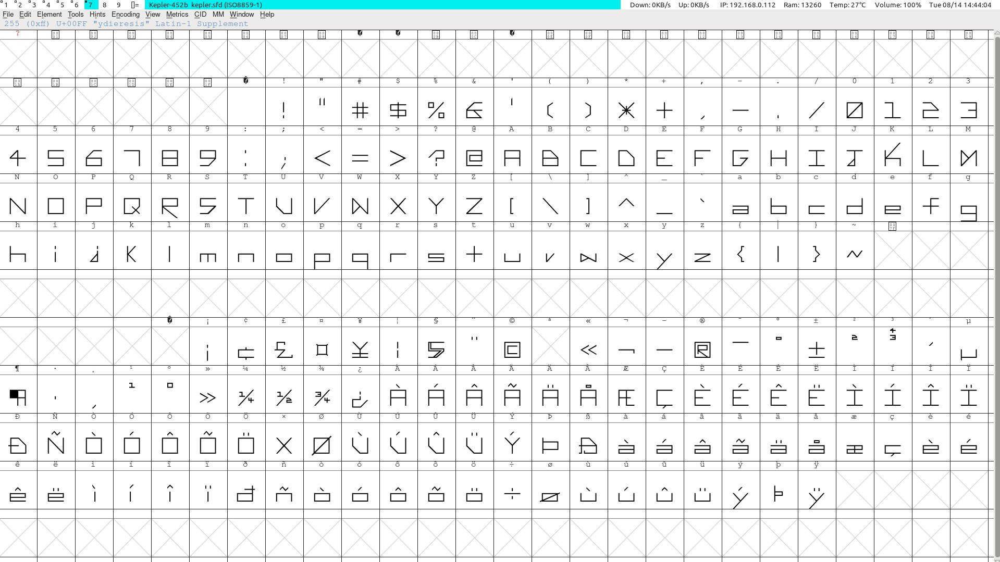

Kepler-452b
===========

Kepler-452b is the first font I've designed. The goal was to create a futuristic / minimal typeface with an angular character to set it apart.

The Design
----------

Kepler-452b is a modern designed typeface. It's glyphs are intended to by highly readable, with similar characters having distinct differences in 
shape for quick recognition. Each letter is the same width, which makes it a good option for programming in.

The Name
--------

It's named after the exoplanet Kepler-452b, which is 1402.5 light years away and has an Earth Similarity Index score of 0.83

>It has a probable mass five times that of Earth, and its surface gravity is twice Earth's, though calculations of mass for exoplanets are only rough estimates. If it is a terrestrial planet, it is most likely a super-Earth with many active volcanoes due to its higher mass and density. The clouds on the planet would be thick and misty, covering much of the surface as viewed from space. From the surface, its star Kepler-452 would look almost identical to the Sun as viewed from the Earth.
_ - via Wikipedia_

To Do
-----

1. Conform to spec and prepare for distribution through Google Fonts.

2. Add italic / bold variants.

3. Additional language support. *I think Crylic characters will look particuly nice with this design.*

License
-------

This work is licensed under the SIL Open Font License (OFL)

Donate
------

You are free to use the font however you like: personal, commercial, etc. However if you enjoy the design and would care to send a couple $$$ my 
way I would be most appreciative :)

[PayPal](https://paypal.me/sammurphey) · [Venmo](https://venmo.com/sammurphey) · [KoFi](https://kofi.com/sammurphey)
