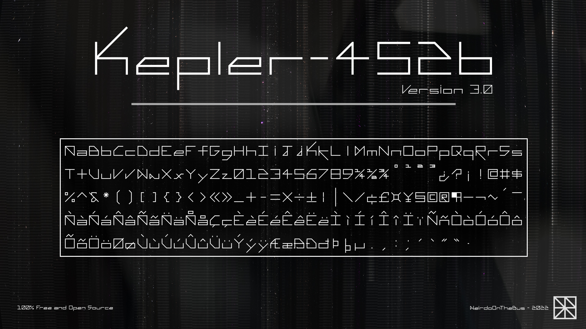

Kepler-452b
===========

The Name
--------

Named after the rocky exoplanet Kepler-452b in the constelation Cygnus, it is one of the most Earth-like planets to be found (often called Earth 2.0).

The Design
----------

Kepler-452b is a futuristic, minimalist font family. Each character has been carefully crafted for optimal legibility and style.

Version 3.0 now offers both Regular and Monospace styles. 

Created using FontForge.

To Do
-----

1. Crylic script support.

2. Bold + italic variants.

3. Submit to Google Fonts.

License
-------

This work is licensed under the [SIL Open Font License (OFL)](https://scripts.sil.org/OFL_web)

Donate
------

Love the project and want to support my work?

[PayPal](https://paypal.me/sammurphey)  ·  [CashApp](https://cash.app/$weirdoonthebus)

